# Image Processing
Manually Applied Different Procedures in Image Processing  


<!-- TABLE OF CONTENTS -->
## Table of Contents

* [About the Project](#about-the-project)
  * [Tech Stack](#tech-stack)
  * [File Structure](#file-structure)
* [Getting Started](#getting-started)
  * [Prerequisites](#prerequisites)
  * [Installation](#installation)
* [Usage](#usage)
* [Results and Demo](#results-and-demo)
* [Future Work](#future-work)
* [Troubleshooting](#troubleshooting)
* [Contributors](#contributors)
* [Acknowledgements and Resources](#acknowledgements-and-resources)
* [License](#license)


<!-- ABOUT THE PROJECT -->
## About The Project
[![In this project][product-screenshot]](https://example.com)  

Aim and Description of project.  
Refer this [documentation](https://link/to/report/)

### Tech Stack
This section should list the technologies you used for this project. Leave any add-ons/plugins for the prerequisite section. Here are a few examples.
* [Numpy](https://numpy.org/)
* [OpenCV](https://opencv.org/)
* [Matplotlib](https://matplotlib.org/)  

### File Structure
    .
    ├── Images                  # Folder containing all the images and results
    ├── ApplyKernel.ipynb       # Code for Applying different filters like blurring and sharpening on the image
    ├── EdgeDetection.ipynb     # Code for detecting edge in an image using vertical, horizontal, Sobel and cranny edge detection               
    ├── Masking.ipynb           # Code for Masking the blue colored ball from the image
    ├── Morphological.ipynb     # Code for applying Erosion and Dilation operations of a binary image
    ├── README.md
    ├── ROI.ipynb               # Code for extracting the Region Of Interest from the image and masking it on a different part of Image
    └── RotateImage.ipynb       # Code for Rotating an image by any angle


<!-- GETTING STARTED -->
<!-- ## Getting Started

### Prerequisites

* See [SETUP.md](https://link/to/setup.md) if there are plenty of instructions
* List of softwares with version tested on
```sh
How to install them
```

* **ESP-IDF v4.0 and above**

  You can visit the [ESP-IDF Programmming Guide](https://docs.espressif.com/projects/esp-idf/en/latest/get-started/index.html#installation-step-by-step) for the installation steps.

* See if you can make requirements.txt  
```sh
pip install -r "requirements.txt"
``` -->

<!-- ### Installation
1. Clone the repo
```sh
git clone https://github.com/your_username_/Project-Name.git
```


<!-- USAGE EXAMPLES -->
<!-- ## Usage
```
How to run the driver code
``` -->
 -->

<!-- RESULTS AND DEMO -->
## Results and Demo
### Image Rotation
| Use  |  Table  |
|:----:|:-------:|
|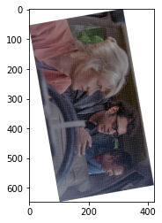|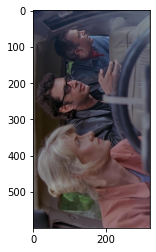|
### Applying Kernels
|  Use  | Table |  Here |
|:-----:|:-----:|:-----:|
|.png)|.png)|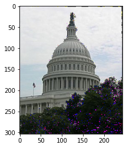|
|Box Filter|Gaussian Filter|Sharpen Filter|
|.png)|.png)|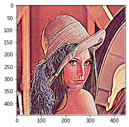|
|Box Filter|Gaussian Filter|Sharpen Filter|
### Edge-Detection

|  Use |  Table  |  Here |
|:----:|:-------:|:-----:|
|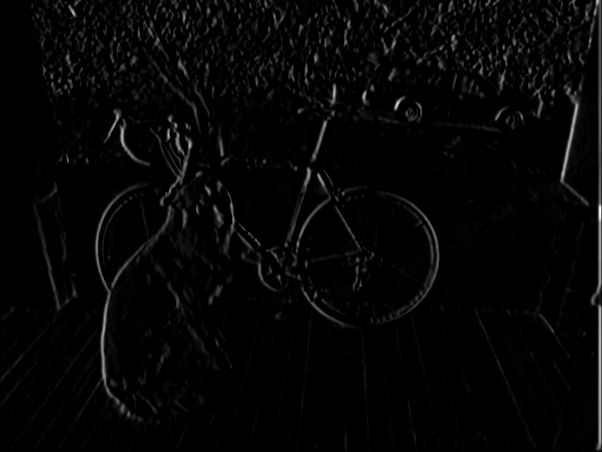|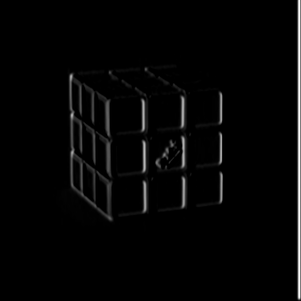|
|Vertical Edge Detection|
||
|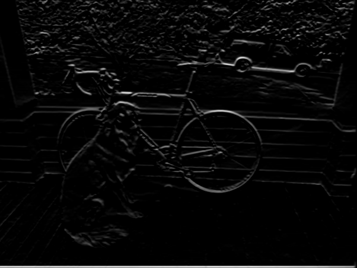|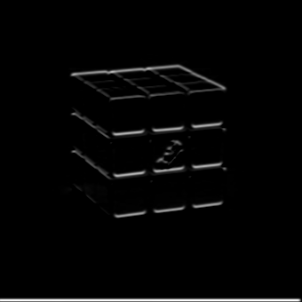|
|Horizontal Edge Detection|
||
|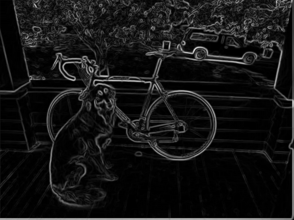|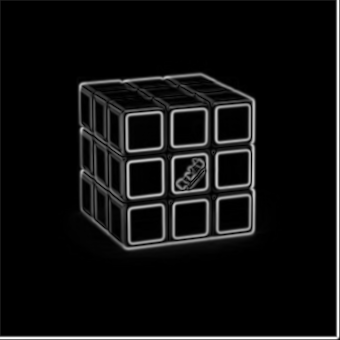|
|Sobel Edge Detection|
||
|||
|Canny Edge Detection|
### Morphological Transformation
| Use |  Table | Here |
|:---:|:------:|:----:|
|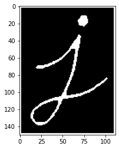|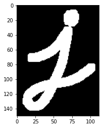|
|Erosion|Dilation|

<!-- FUTURE WORK -->
<!-- ## Future Work
* See [todo.md](https://todo.md) for seeing developments of this project
- [x] Task 1
- [x] Task 2
- [ ] Task 3
- [ ] Task 4 -->


<!-- TROUBLESHOOTING -->
## Troubleshooting
* Common errors while configuring the project


<!-- CONTRIBUTORS -->
## Contributors
* [Saad Hashmi](https://github.com/hashmis79)
* [Member Name](https://github.com/id)


<!-- ACKNOWLEDGEMENTS AND REFERENCES -->
## Acknowledgements and Resources
* [SRA VJTI](http://sra.vjti.info/) Eklavya 2020  
* Refered [this](https://link) for achieving this  
...


<!-- LICENSE -->
## License
Describe your [License](LICENSE) for your project.
