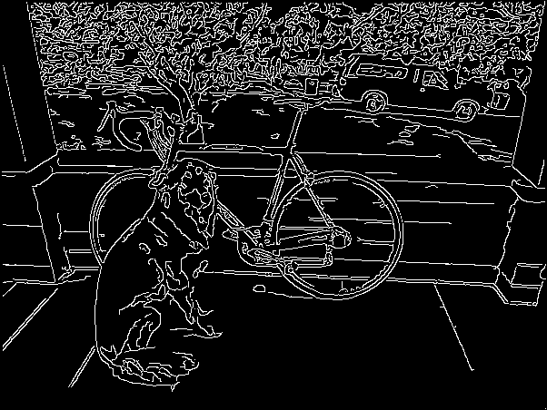
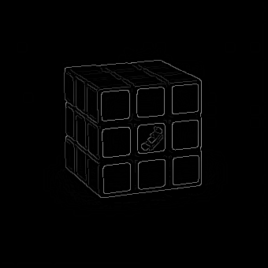
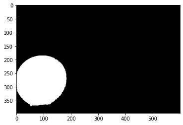

# Image Processing
Manually Applied Different Procedures in Image Processing  


<!-- TABLE OF CONTENTS -->
## Table of Contents

* [About the Project](#about-the-project)
  * [Tech Stack](#tech-stack)
  * [File Structure](#file-structure)
<!-- * [Getting Started](#getting-started) -->
  <!-- * [Prerequisites](#prerequisites) -->
  <!-- * [Installation](#installation) -->
<!-- * [Usage](#usage) -->
* [Results and Demo](#results-and-demo)
<!-- * [Future Work](#future-work) -->
* [Troubleshooting](#troubleshooting)
* [Contributors](#contributors)
* [Acknowledgements and Resources](#acknowledgements-and-resources)
<!-- * [License](#license) -->


<!-- ABOUT THE PROJECT -->
<!-- ## About The Project
[![In this project][product-screenshot]](https://example.com)  

Aim and Description of project.  
Refer this [documentation](https://link/to/report/) -->

### Tech Stack
This section should list the technologies you used for this project. Leave any add-ons/plugins for the prerequisite section. Here are a few examples.
* [Numpy](https://numpy.org/)
* [OpenCV](https://opencv.org/)
* [Matplotlib](https://matplotlib.org/)  

### File Structure
    .
    ├── Images                  # Folder containing all the images and results
    ├── ApplyKernel.ipynb       # Code for Applying different filters like blurring and sharpening on the image
    ├── EdgeDetection.ipynb     # Code for detecting edge in an image using vertical, horizontal, Sobel and cranny edge detection               
    ├── Masking.ipynb           # Code for Masking the blue colored ball from the image
    ├── Morphological.ipynb     # Code for applying Erosion and Dilation operations of a binary image
    ├── README.md
    ├── ROI.ipynb               # Code for extracting the Region Of Interest from the image and masking it on a different part of Image
    └── RotateImage.ipynb       # Code for Rotating an image by any angle


<!-- GETTING STARTED -->
<!-- ## Getting Started

### Prerequisites

* See [SETUP.md](https://link/to/setup.md) if there are plenty of instructions
* List of softwares with version tested on
```sh
How to install them
```

* **ESP-IDF v4.0 and above**

  You can visit the [ESP-IDF Programmming Guide](https://docs.espressif.com/projects/esp-idf/en/latest/get-started/index.html#installation-step-by-step) for the installation steps.

* See if you can make requirements.txt  
```sh
pip install -r "requirements.txt"
``` -->

<!-- ### Installation
1. Clone the repo
```sh
git clone https://github.com/your_username_/Project-Name.git
```


<!-- USAGE EXAMPLES -->
<!-- ## Usage
```
How to run the driver code
``` -->


<!-- RESULTS AND DEMO -->
## Results and Demo
### Image Rotation
Image rotation is a common image processing routine with applications in matching, alignment, and other image-based algorithms.
| | |
|:----:|:-------:|
|||
### Applying Kernels
An image kernel is a small matrix used to apply effects like the ones you might find in Photoshop or Gimp, such as blurring, sharpening, outlining or embossing. They're also used in machine learning for 'feature extraction', a technique for determining the most important portions of an image. We will be applying 2 kernel operations
1) Blurring 2) Sharpening
| | | |
|:-----:|:-----:|:-----:|
|.png)|.png)||
|Box Filter|Gaussian Filter|Sharpen Filter|
|.png)|.png)||
|Box Filter|Gaussian Filter|Sharpen Filter|
### Edge-Detection
Edge Detection is a technique used for finding the boundaries of objects within images. IT works by detecting discontinuities in an image.Here we will be using 4 methods for edge Detection
1) Vertical Edge Detection
2) Horizontal Edge Detection
3) Sobel Edge Detection
4) Cranny Edge Detection
#### Input images
| | |
|:----:|:-------:|
|||
#### Output
| | | |
|:----:|:-------:|
|||
|Vertical Edge Detection|
||
|||
|Horizontal Edge Detection|
||
|||
|Sobel Edge Detection|
||
|||
|Canny Edge Detection|
### Morphological Transformation
Morphological Transformations are some simple operations based on the image shape. It is normally performed on binary images.The basic operations we will be doing will be
1) Erosion - It basically erodes away the boundaries of the foreground object. Hence used for image noise reduction.
2) Dilation - It is the opposite of erosion. It increase the area of the object. Used for restoring eroded images.
| | | |
|:---:|:---:|:---:|
||||
|Original|Erosion|Dilation|
### Masking
A mask is a binary image consisting of zero- and non-zero values. If a mask is applied to another binary or to a grayscale image of the same size, all pixels which are zero in the mask are set to zero in the output image. All others remain unchanged.
| | |
|:---:|:------:|
|||
|Original|Masking|
### Region Of Interest
A region of interest (ROI) is a portion of an image that you want to filter or perform some other operation on. You define an ROI by creating a binary mask, which is a binary image that is the same size as the image you want to process with pixels that define the ROI set to 1 and all other pixels set to 0.
| | |
|:---:|:------:|
|||
|Original|ROI|
<!-- FUTURE WORK -->
<!-- ## Future Work
* See [todo.md](https://todo.md) for seeing developments of this project
- [x] Task 1
- [x] Task 2
- [ ] Task 3
- [ ] Task 4 -->


<!-- TROUBLESHOOTING -->
## Troubleshooting
* Common errors while configuring the project


<!-- CONTRIBUTORS -->
## Contributors
* [Saad Hashmi](https://github.com/hashmis79)


<!-- ACKNOWLEDGEMENTS AND REFERENCES -->
## Acknowledgements and Resources
* [SRA VJTI](http://sra.vjti.info/)  
* Refered [OpenCV Tutorial](https://docs.opencv.org/trunk/d6/d00/tutorial_py_root.html) for achieving the basics of the above operations
* Refered [this](https://towardsdatascience.com/canny-edge-detection-step-by-step-in-python-computer-vision-b49c3a2d8123) for achieving Canny Edge Detection  

...


<!-- LICENSE -->
## License
Describe your [License](LICENSE) for your project.
